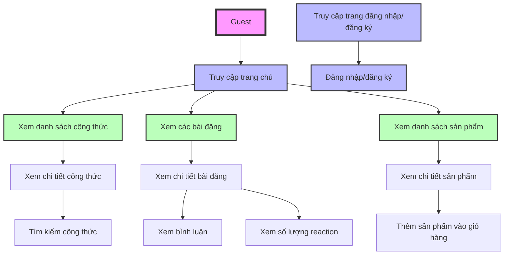
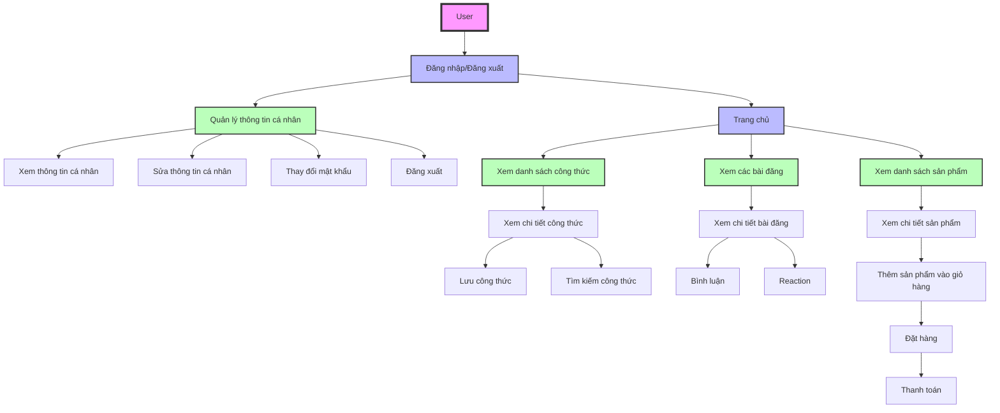
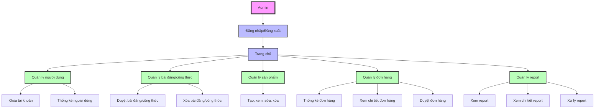

```mermaid
flowchart TD
    A[Guest] --> B[Truy cập trang chủ]
    B --> C[Xem danh sách công thức]
    B --> D[Xem các bài đăng]
    B --> E[Xem danh sách sản phẩm]

    C --> C1[Xem chi tiết công thức]
    C1 --> C2[Tìm kiếm công thức]

    D --> D1[Xem chi tiết bài đăng]
    D1 --> D2[Xem bình luận]
    D1 --> D3[Xem số lượng reaction]

    E --> E1[Xem chi tiết sản phẩm]
    E1 --> E2[Thêm sản phẩm vào giỏ hàng]

    F[Truy cập trang đăng nhập/đăng ký] --> G[Đăng nhập/đăng ký]

    style A fill:#f9f,stroke:#333,stroke-width:4px;
    style B fill:#bbf,stroke:#333,stroke-width:2px;
    style C fill:#bfb,stroke:#333,stroke-width:2px;
    style D fill:#bfb,stroke:#333,stroke-width:2px;
    style E fill:#bfb,stroke:#333,stroke-width:2px;
    style F fill:#bbf,stroke:#333,stroke-width:2px;
    style G fill:#bbf,stroke:#333,stroke-width:2px;
```

```mermaid
flowchart TD
    A[User] --> B[Đăng nhập/Đăng xuất]
    B --> C[Trang chủ]
    B --> D[Quản lý thông tin cá nhân]
    D --> D1[Xem thông tin cá nhân]
    D --> D2[Sửa thông tin cá nhân]
    D --> D3[Thay đổi mật khẩu]
    D --> D4[Đăng xuất]
    C --> E[Xem danh sách công thức]
    C --> F[Xem các bài đăng]
    C --> G[Xem danh sách sản phẩm]

    E --> E1[Xem chi tiết công thức]
    E1 --> E2[Lưu công thức]
    E1 --> E3[Tìm kiếm công thức]

    F --> F1[Xem chi tiết bài đăng]
    F1 --> F2[Bình luận]
    F1 --> F3[Reaction]

    G --> G1[Xem chi tiết sản phẩm]
    G1 --> G2[Thêm sản phẩm vào giỏ hàng]
    G2 --> G3[Đặt hàng]
    G3 --> G4[Thanh toán]

    style A fill:#f9f,stroke:#333,stroke-width:4px;
    style B fill:#bbf,stroke:#333,stroke-width:2px;
    style C fill:#bbf,stroke:#333,stroke-width:2px;
    style D fill:#bfb,stroke:#333,stroke-width:2px;
    style E fill:#bfb,stroke:#333,stroke-width:2px;
    style F fill:#bfb,stroke:#333,stroke-width:2px;
    style G fill:#bfb,stroke:#333,stroke-width:2px;

```

```mermaid
flowchart TD
    A[Admin] --> B[Đăng nhập/Đăng xuất]
    B --> C[Trang chủ]
    C --> D[Quản lý người dùng]
    C --> E[Quản lý bài đăng/công thức]
    C --> F[Quản lý sản phẩm]
    C --> G[Quản lý đơn hàng]
    C --> H[Quản lý report]

    D --> D1[Khóa tài khoản]
    D --> D2[Thống kê người dùng]

    E --> E1[Duyệt bài đăng/công thức]
    E --> E2[Xóa bài đăng/công thức]

    F --> F1[Tạo, xem, sửa, xóa]

    G --> G1[Thống kê đơn hàng]
    G --> G2[Xem chi tiết đơn hàng]
    G --> G3[Duyệt đơn hàng]

    H --> H1[Xem report]
    H --> H2[Xem chi tiết report]
    H --> H3[Xử lý report]

    style A fill:#f9f,stroke:#333,stroke-width:4px;
    style B fill:#bbf,stroke:#333,stroke-width:2px;
    style C fill:#bbf,stroke:#333,stroke-width:2px;
    style D fill:#bfb,stroke:#333,stroke-width:2px;
    style E fill:#bfb,stroke:#333,stroke-width:2px;
    style F fill:#bfb,stroke:#333,stroke-width:2px;
    style G fill:#bfb,stroke:#333,stroke-width:2px;
    style H fill:#bfb,stroke:#333,stroke-width:2px;
```
