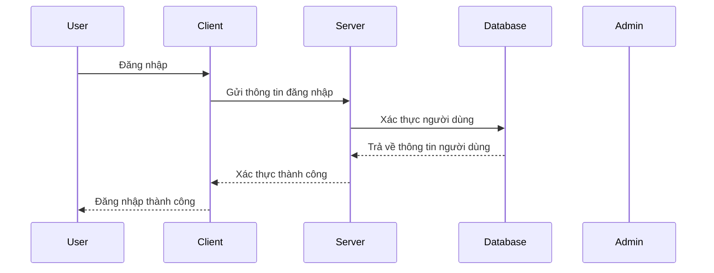
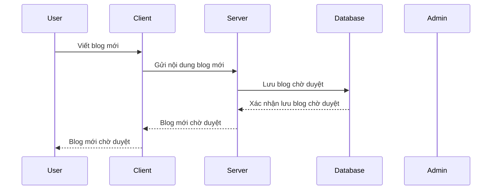
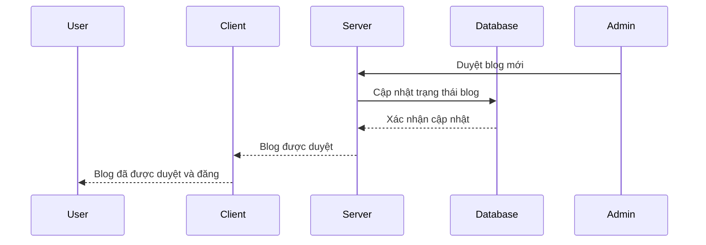
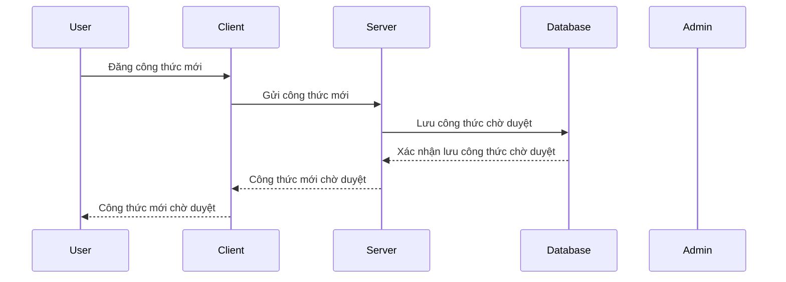
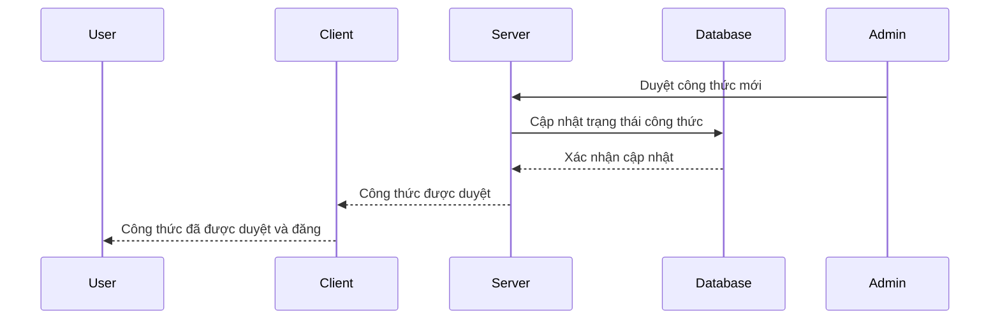
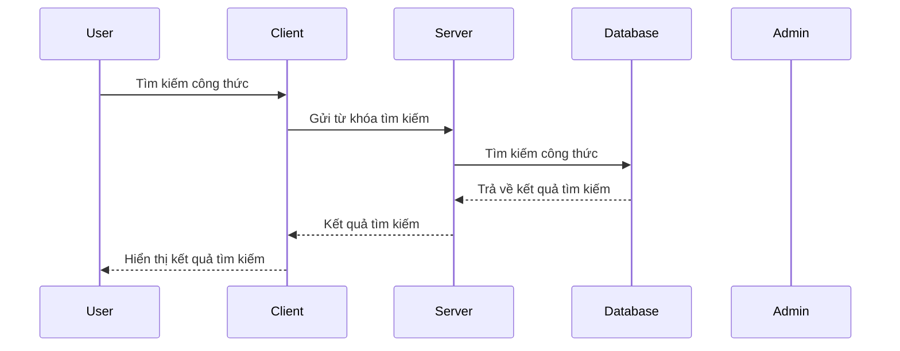
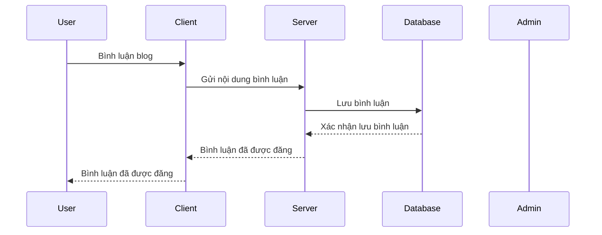
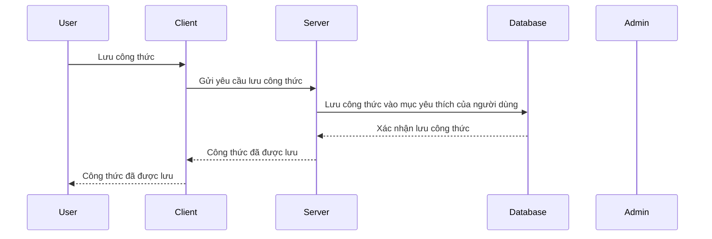
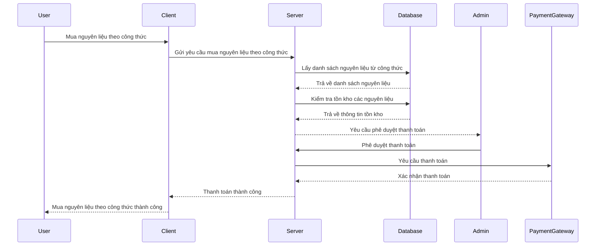
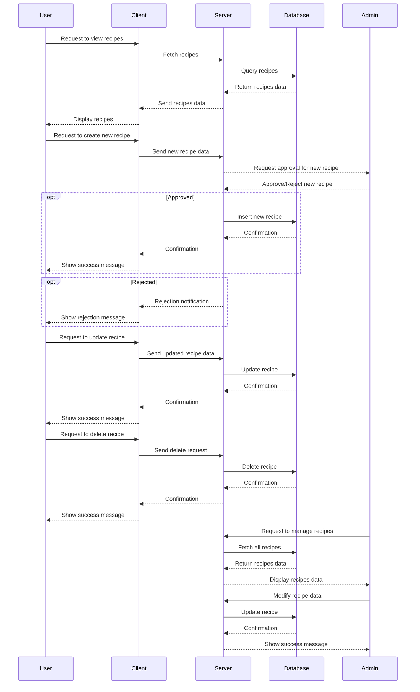

```mermaid
sequenceDiagram
    participant User
    participant Client
    participant Server
    participant Database
    participant Admin

    User->>Client: Đăng nhập
    Client->>Server: Gửi thông tin đăng nhập
    Server->>Database: Xác thực người dùng
    Database-->>Server: Trả về thông tin người dùng
    Server-->>Client: Xác thực thành công
    Client-->>User: Đăng nhập thành công
```

```mermaid
sequenceDiagram
    participant User
    participant Client
    participant Server
    participant Database
    participant Admin

    User->>Client: Viết blog mới
    Client->>Server: Gửi nội dung blog mới
    Server->>Database: Lưu blog chờ duyệt
    Database-->>Server: Xác nhận lưu blog chờ duyệt
    Server-->>Client: Blog mới chờ duyệt
    Client-->>User: Blog mới chờ duyệt
```

```mermaid
sequenceDiagram
    participant User
    participant Client
    participant Server
    participant Database
    participant Admin

    Admin->>Server: Duyệt blog mới
    Server->>Database: Cập nhật trạng thái blog
    Database-->>Server: Xác nhận cập nhật
    Server-->>Client: Blog được duyệt
    Client-->>User: Blog đã được duyệt và đăng
```

```mermaid
sequenceDiagram
    participant User
    participant Client
    participant Server
    participant Database
    participant Admin
    User->>Client: Đăng công thức mới
    Client->>Server: Gửi công thức mới
    Server->>Database: Lưu công thức chờ duyệt
    Database-->>Server: Xác nhận lưu công thức chờ duyệt
    Server-->>Client: Công thức mới chờ duyệt
    Client-->>User: Công thức mới chờ duyệt
```

```mermaid
sequenceDiagram
    participant User
    participant Client
    participant Server
    participant Database
    participant Admin

    Admin->>Server: Duyệt công thức mới
    Server->>Database: Cập nhật trạng thái công thức
    Database-->>Server: Xác nhận cập nhật
    Server-->>Client: Công thức được duyệt
    Client-->>User: Công thức đã được duyệt và đăng
```

```mermaid
sequenceDiagram
    participant User
    participant Client
    participant Server
    participant Database
    participant Admin

    User->>Client: Tìm kiếm công thức
    Client->>Server: Gửi từ khóa tìm kiếm
    Server->>Database: Tìm kiếm công thức
    Database-->>Server: Trả về kết quả tìm kiếm
    Server-->>Client: Kết quả tìm kiếm
    Client-->>User: Hiển thị kết quả tìm kiếm
```

```mermaid
sequenceDiagram
    participant User
    participant Client
    participant Server
    participant Database
    participant Admin

    User->>Client: Bình luận blog
    Client->>Server: Gửi nội dung bình luận
    Server->>Database: Lưu bình luận
    Database-->>Server: Xác nhận lưu bình luận
    Server-->>Client: Bình luận đã được đăng
    Client-->>User: Bình luận đã được đăng
```

```mermaid
sequenceDiagram
    participant User
    participant Client
    participant Server
    participant Database
    participant Admin

    User->>Client: Lưu công thức
    Client->>Server: Gửi yêu cầu lưu công thức
    Server->>Database: Lưu công thức vào mục yêu thích của người dùng
    Database-->>Server: Xác nhận lưu công thức
    Server-->>Client: Công thức đã được lưu
    Client-->>User: Công thức đã được lưu

```

```mermaid
sequenceDiagram
    participant User
    participant Client
    participant Server
    participant Database
    participant Admin

    User->>Client: Mua nguyên liệu theo công thức
    Client->>Server: Gửi yêu cầu mua nguyên liệu theo công thức
    Server->>Database: Lấy danh sách nguyên liệu từ công thức
    Database-->>Server: Trả về danh sách nguyên liệu
    Server->>Database: Kiểm tra tồn kho các nguyên liệu
    Database-->>Server: Trả về thông tin tồn kho
    Server-->>Admin: Yêu cầu phê duyệt thanh toán
    Admin->>Server: Phê duyệt thanh toán
    Server->>PaymentGateway: Yêu cầu thanh toán
    PaymentGateway-->>Server: Xác nhận thanh toán
    Server-->>Client: Thanh toán thành công
    Client-->>User: Mua nguyên liệu theo công thức thành công

```

```mermaid
sequenceDiagram
    participant User
    participant Client
    participant Server
    participant Database
    participant Admin

    User->>Client: Request to view recipes
    Client->>Server: Fetch recipes
    Server->>Database: Query recipes
    Database-->>Server: Return recipes data
    Server-->>Client: Send recipes data
    Client-->>User: Display recipes

    User->>Client: Request to create new recipe
    Client->>Server: Send new recipe data
    Server-->>Admin: Request approval for new recipe
    Admin-->>Server: Approve/Reject new recipe
    opt Approved
        Server->>Database: Insert new recipe
        Database-->>Server: Confirmation
        Server-->>Client: Confirmation
        Client-->>User: Show success message
    end
    opt Rejected
        Server-->>Client: Rejection notification
        Client-->>User: Show rejection message
    end

    User->>Client: Request to update recipe
    Client->>Server: Send updated recipe data
    Server->>Database: Update recipe
    Database-->>Server: Confirmation
    Server-->>Client: Confirmation
    Client-->>User: Show success message

    User->>Client: Request to delete recipe
    Client->>Server: Send delete request
    Server->>Database: Delete recipe
    Database-->>Server: Confirmation
    Server-->>Client: Confirmation
    Client-->>User: Show success message

    Admin->>Server: Request to manage recipes
    Server->>Database: Fetch all recipes
    Database-->>Server: Return recipes data
    Server-->>Admin: Display recipes data
    Admin->>Server: Modify recipe data
    Server->>Database: Update recipe
    Database-->>Server: Confirmation
    Server-->>Admin: Show success message
```
